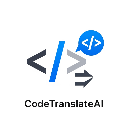

# CodeTranslateAI 🚀

<p align="center">
  
</p>

<h3 align="center">Seamless On-Page Code Translation, Powered by AI</h3>

<p align="center">
  CodeTranslateAI is a powerful browser extension that allows you to translate code snippets on any webpage in real-time. Simply select a block of code, choose your target language, and get an AI-powered translation instantly.
</p>

<p align="center">
    <p align="center">
        <a href="https://chromewebstore.google.com/detail/cbopkkjljoiabjobmjhmoaglkiffgpel?utm_source=item-share-cb" style="text-decoration: none;">
            
        </a>
        &nbsp;&nbsp;
        <a href="https://microsoftedge.microsoft.com/addons/detail/codetranslateai/lkdmdgdalcmbhfjakgmgljkknmbafbjp" style="text-decoration: none;">
            
        </a>
    </p>
    <p align="center">
        <b>
            Choose your browser and click the button above to download and install CodeTranslateAI instantly!
        </b>
    </p>

---

## ✨ Features in Action

See CodeTranslateAI work seamlessly on any webpage. Select code, and the translated version appears right beside it in a clean, tabbed interface with syntax highlighting.

## 

## 

## 

---

## 🔧 Tech Stack

- **Frontend:**
  - Modular JavaScript (ES6+)
  - **esbuild** & **dotenv** (for bundling and environment variables)
  - HTML5 & CSS3
  - Chrome Extension APIs (`storage`, `activeTab`)
  - Shadow DOM for style isolation.
- **Backend:**
  - Cloudflare Workers
  - TypeScript
  - Wrangler CLI
  - Google Gemini API

---

## 📚 Getting Started & Installation Guide

To get a local copy up and running, follow these simple steps.

### Prerequisites

You must have **Node.js** and **npm** installed on your machine.

- [Download Node.js](https://nodejs.org/)

### ⚙️ Part 1: Backend Setup (Cloudflare Worker)

1.  **Clone the Repository**

    ```sh
    git clone https://github.com/dineshsutihar/CodeTranslateAI.git
    cd CodeTranslateAI/backend
    ```

2.  **Install Dependencies**

    ```sh
    npm install
    ```

3.  **Login to Cloudflare**

    ```sh
    npx wrangler login
    ```

4.  **Get a Gemini API Key**

    - Go to [Google AI Studio](https://aistudio.google.com/) to create your free API key.

5.  **Set the Secret Key**

    - Run the following command and paste your Gemini API key when prompted.

    <!-- end list -->

    ```sh
    npx wrangler secret put GEMINI_API_KEY
    ```

6.  **Deploy the Worker**

    - Deploy the backend to make it live.

    <!-- end list -->

    ```sh
    npx wrangler deploy
    ```

    - After deployment, **copy the URL** that Wrangler provides.

### 🖥️ Part 2: Frontend Setup (Chrome Extension)

1.  **Navigate to the Frontend Directory**

    ```sh
    cd ../frontend
    ```

2.  **Install Dependencies**

    ```sh
    npm install
    ```

3.  **Configure the Backend URL**

    - In the `frontend` folder, create a new file named `.env`.
    - Add the Cloudflare Worker URL you copied in the previous step to this file:

    <!-- end list -->

    ```
    # .env file
    BACKEND_URL="https://your-worker-url.workers.dev"
    ```

4.  **Create the Build Configuration**

    - In the `frontend` folder, create a file named `build.js` and add the following content. This file tells our build script how to use the `.env` variable.

    <!-- end list -->

    ```javascript
    // build.js
    import esbuild from "esbuild";
    import "dotenv/config";

    const define = {};
    for (const k in process.env) {
      define[`process.env.${k}`] = JSON.stringify(process.env[k]);
    }

    esbuild
      .build({
        entryPoints: ["scripts/content.js", "background.js"],
        bundle: true,
        outdir: "dist",
        define: define,
      })
      .catch(() => process.exit(1));
    ```

5.  **Build the Extension**

    - Run the build command to bundle your scripts and inject the environment variable.

    <!-- end list -->

    ```sh
    npm run build
    ```

    This will create a `dist` folder containing your final `content.js` and `background.js` files.

6.  **Load the Extension in Chrome**

    - Open Google Chrome and navigate to `chrome://extensions`.
    - Enable **"Developer mode"**.
    - Click the **"Load unpacked"** button.
    - Select your Chrome extension folder (the `frontend` folder that contains `manifest.json`).

The **CodeTranslateAI** icon should now appear in your Chrome toolbar\!

---

## 💻 Development Workflow

1.  Make any changes to your JavaScript files in the `scripts/` folder or `background.js`.
2.  Run the build command in your terminal:
    ```sh
    npm run build
    ```
3.  Go to `chrome://extensions` and click the **reload** button for the CodeTranslateAI extension.

---

## 📖 How to Use

1.  Click the extension icon in the Chrome toolbar.
2.  Select your desired target language from the dropdown menu.
3.  Click the **"Enable Code Selector"** button.
4.  Your cursor will change to a crosshair. Click on any code block on a webpage.
5.  A "Translating..." message will appear, followed by the translated code in a new UI.

---

## 🐛 Debugging the Backend

If you encounter errors, check the live logs from your Cloudflare Worker.

1.  **Navigate to your Backend Directory**.
2.  **Run the Tail Command**:
    ```sh
    npx wrangler tail
    ```
3.  **Trigger the Error** by using the extension in your browser and check the terminal for error messages.

---

## ⚖️ License

Distributed under the MIT License.
